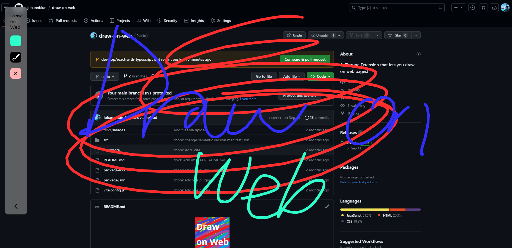

# Draw on web

`드로우 온 웹(Draw on web)` 은 웹 페이지 위에 브러쉬 기능을 사용가능하게 해주는 크롬 익스텐션입니다.

현재 드로우 온 웹은 프로토타입이며, 현재 사용 가능한 기능은 다음과 같습니다.

- 캔버스 토글
- 브러쉬 색상 설정
- 브러쉬 두께 설정
- 캔버스 초기화

## 설치

해당 깃허브 페이지 내 우측 Releases 에 들어가서 설치가 가능합니다.

그후 크롬 익스텐션 설정창에 들어가서, 개발자 모드 켭니다.

해당 창에 압축해제한 확장프로그램 폴더를 끌어다 놓으면 됩니다.

## 기능

### 캔버스 토글

드로우 온 웹이 로딩된 웹페이지에서 `Alt + 1` 을 누르면 팔레트가 나옵니다.
팔레트가 나온 상태에서 `우클릭`을 드래그 하시면 지정된 색상과 굵기로 브러쉬를 그릴 수 있습니다.

### 브러쉬 색상 설정

팔레트 첫번째 아이콘을 누르면 색상 변경이 가능합니다.

### 브러쉬 두께 설정
브러쉬 아이콘을 클릭하면 브러쉬의 두께를 설정할 수 있습니다.

## Collaborating

해당 프로젝트에 기여해주시는 모든 분들께 환영합니다. `PR`을 받고 있으니 관심 있으시면 부탁드리겠습니다.